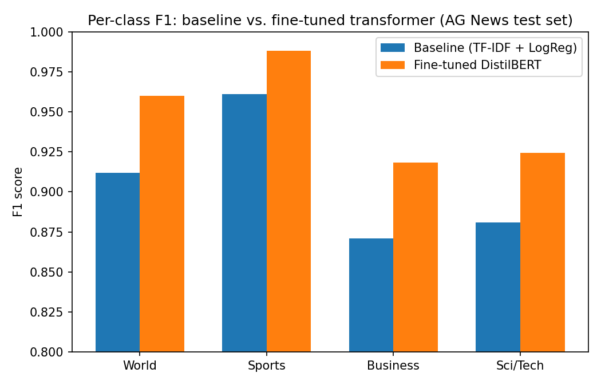

# News Topic Classifier

A news-headline topic classifier with two models shown side by side: a classical TF-IDF +
logistic regression baseline (trained live, on real data, every time the service starts) and a
fine-tuned DistilBERT transformer — so the transformer's extra complexity has to earn its
accuracy against a real number, not an assumed one.

Both models classify into the same four AG News topics: **World, Sports, Business, Sci/Tech**.

## Why this exists

Every "we fine-tuned a transformer" project should be able to answer one question: is it
actually better than the boring, cheap thing? This project measures that directly instead of
assuming it. The classical baseline is trained on 40,000 real AG News articles and evaluated on
the full 7,600-article official held-out test set every time the app starts — no cached numbers,
no mocked metrics. It scores **90.5% accuracy / 0.904 macro F1**, which is the bar the
transformer has to clear.

## The Hugging Face Hub constraint — and how it's handled

The environment this project was built in cannot reach `huggingface.co` at all — confirmed
directly (a raw HTTP request to the Hub returns `403 Forbidden` at the network layer, not a
library error). That means `AutoModelForSequenceClassification.from_pretrained("distilbert-base-uncased")`
can't download pretrained weights there, so the actual fine-tuning step can't run in that
environment.

Rather than skip the transformer half of the project or fake the numbers, the fine-tuning step
was split out into `notebooks/finetune_distilbert_ag_news.ipynb` — a self-contained Colab
notebook that loads the *exact same* real AG News train/test data (same source, same rows) used
by the baseline here, fine-tunes `distilbert-base-uncased` for 3 epochs, evaluates on the
identical 7,600-row test set, and prints an honest comparison against the baseline's real
measured numbers (hardcoded from the actual run below, not placeholders) — including saying
plainly if the transformer *doesn't* beat the baseline, rather than only reporting it if it wins.

Until that notebook has been run and its output copied into `models/ag_news_distilbert/`, the
service runs the baseline only and reports the transformer honestly as not loaded — same pattern
as this portfolio's Emotion Insight Assistant, which surfaces `weights_loaded: false` instead of
silently predicting from randomly-initialized weights and pretending the numbers mean something.

```json
{
  "transformer_loaded": false,
  "transformer_status": "No fine-tuned weights found at .../models/ag_news_distilbert. Run notebooks/finetune_distilbert_ag_news.ipynb and copy its output here."
}
```

### Running the notebook

1. Open `notebooks/finetune_distilbert_ag_news.ipynb` in [Google Colab](https://colab.research.google.com/) (upload it, or open from GitHub once this repo is pushed).
2. `Runtime → Change runtime type → T4 GPU` (not required, but 3 epochs over 120,000 examples takes ~15-25 min on a GPU vs. 2-3+ hours on CPU).
3. Run all cells. The last cells save the fine-tuned model, print the real comparison against the baseline, and download a zip.
4. Unzip it into `models/ag_news_distilbert/` in this repo (so `config.json`, `model.safetensors`, `tokenizer.json` etc. sit directly in that folder).
5. Restart the service — the landing page will show the transformer's predictions next to the baseline's instead of the "not loaded yet" notice.

The notebook also writes `results_summary.json` alongside the model with the exact measured
numbers from that run, worth keeping if you want to update the comparison table below with your
own result.

## The data

[AG News](http://groups.di.unipi.it/~gulli/AG_corpus_of_news_articles.html) (Zhang, Zhao &
LeCun, 2015) — a standard, widely-used public benchmark for topic classification. 4 balanced
classes, sourced via a well-known plain-CSV GitHub mirror
([`mhjabreel/CharCnn_Keras`](https://github.com/mhjabreel/CharCnn_Keras)) since the sandbox this
project was built in can also reach `raw.githubusercontent.com` (unlike `huggingface.co`) —
`scripts/fetch_data.py` re-downloads and re-samples from there.

- `data/ag_news_train_sample.csv` — 40,000 rows, stratified 10,000 per class (`random.seed(42)`), used to train the baseline.
- `data/ag_news_test.csv` — 7,600 rows, the full official AG News test set, used to evaluate both models on an identical split.

## Measured results

TF-IDF (unigrams + bigrams, 30,000 features) + logistic regression, trained on the 40,000-row
sample, evaluated on the full 7,600-row test set:

| Metric | Baseline | Fine-tuned DistilBERT | Delta |
|---|---|---|---|
| Accuracy | 90.5% | 94.8% | +4.3pp |
| Macro F1 | 0.904 | 0.948 | +0.043 |

| Class | Baseline F1 | DistilBERT F1 | Delta |
|---|---|---|---|
| World | 0.909 | 0.960 | +0.051 |
| Sports | 0.961 | 0.988 | +0.027 |
| Business | 0.869 | 0.918 | +0.049 |
| Sci/Tech | 0.878 | 0.924 | +0.046 |



Sports is the easiest class to separate for both models (distinctive vocabulary, smallest gap
between them); Business and Sci/Tech are the most confused with each other for the baseline
(shows up in the confusion matrix at `GET /baseline/metrics`) — tech-company earnings and
product-launch headlines genuinely straddle both categories — and those are exactly the two
classes where the transformer's fine-tuning earns the biggest gain, which is the expected
pattern: a transformer should help most on the cases plain TF-IDF genuinely struggles to
disambiguate, not spread its improvement evenly.

The DistilBERT numbers come from `notebooks/finetune_distilbert_ag_news.ipynb` (3 epochs, T4
GPU, ~18 min) and are independently reproducible locally with
`scripts/evaluate_transformer.py` once the fine-tuned weights are copied into
`models/ag_news_distilbert/` — see "Experiment tracking" below.

## Running it

```bash
pip install -r requirements.txt
uvicorn app.main:app --reload
```

Open `http://localhost:8000/` for the landing page, or `http://localhost:8000/docs` for the
interactive API reference. The baseline trains itself at startup (~15s); no setup needed for it.

Dependencies are split into two files on purpose:

- `requirements.txt` — the light, always-needed base (FastAPI, the sklearn baseline, tests). This
  alone boots the full service; with no transformer weights present it serves the baseline and
  reports `transformer_loaded: false` honestly. Peak memory ~380 MB, so it runs on a small
  free-tier host.
- `requirements-transformer.txt` — the heavier deps (`torch`, `transformers`, plus `mlflow` /
  `matplotlib` for the eval script). Install these too, and drop the fine-tuned weights into
  `models/ag_news_distilbert/`, to get real side-by-side transformer predictions locally:

  ```bash
  pip install -r requirements-transformer.txt
  ```

  `torch` alone is a 400 MB–2 GB download, which is exactly why it's kept out of the base and out
  of the deployed service — a live demo running only the baseline neither needs it nor (on a
  free 512 MB instance) has the memory to load a transformer.

### API

| Endpoint | Description |
|---|---|
| `GET /` | Landing page |
| `GET /health` | Service status, whether baseline/transformer are loaded |
| `GET /classes` | The four topic labels |
| `GET /baseline/metrics` | Real measured accuracy, macro F1, per-class F1, confusion matrix |
| `POST /predict` | `{"text": "..."}` → baseline prediction, plus transformer prediction if loaded |

### Tests

```bash
pytest
```

14 tests, all against real data and a real trained model — no mocks. `tests/test_baseline.py`
trains the classical pipeline and asserts on its real measured accuracy/F1 (not a fixed
placeholder, but a realistic threshold that would fail if the pipeline broke). `tests/test_api.py`
exercises the full FastAPI app, including asserting that a fresh checkout with no transformer
weights present degrades gracefully (`transformer_loaded: false`, a clear `transformer_status`
message, `transformer: null` from `/predict`) rather than erroring.

### Experiment tracking (MLflow)

Once the fine-tuned weights are in `models/ag_news_distilbert/` (see "Running the notebook"
above), `scripts/evaluate_transformer.py` independently reproduces the baseline-vs-transformer
comparison — it doesn't just trust the numbers the notebook printed, it re-runs both models
against the real 7,600-row test set itself and logs the run to MLflow:

```bash
python scripts/evaluate_transformer.py
mlflow ui --backend-store-uri sqlite:///mlflow.db   # http://localhost:5000
```

Logs both models' accuracy, macro F1, and per-class F1 as MLflow metrics, plus a saved
`docs/transformer_vs_baseline.png` comparison chart as an MLflow artifact. Same local-SQLite,
zero-external-services approach as this portfolio's other MLflow-tracked projects
(`swiss-claims-assistant`, `bedding-franchise-erp`). Deliberately not wired into CI: the
fine-tuned weights are gitignored on purpose (see above), so a fresh CI checkout never has them
to evaluate against — this script is for whoever has actually run the notebook and has real
weights sitting locally.

### Docker

```bash
docker build -t news-topic-classifier .
docker run -p 8000:8000 news-topic-classifier
```

`CMD` uses shell form (`sh -c "... --port ${PORT:-8000}"`) so platforms like Render that assign
their own `$PORT` are respected automatically, rather than the port being hardcoded — a lesson
learned the hard way while deploying an earlier project in this portfolio.

### Live demo

Deployed on Render's free tier: **[link added once deployed]**. The live service installs
`requirements.txt` only (the light base), so it runs the **classical baseline** — submit a
headline on the landing page and get a real, live topic prediction — and honestly reports the
transformer as not loaded (`transformer_loaded: false`). That's deliberate, not a shortcut: a
free 512 MB instance can't hold PyTorch plus a fine-tuned DistilBERT in memory, so the
transformer is a **local** capability (see "Running it"), while its real, measured advantage over
the baseline is documented and reproducible above (the comparison table, the chart, and
`scripts/evaluate_transformer.py`). The free tier also spins the service down after 15 minutes
idle, so the first request after a lull takes ~30-50s to wake it up.

## What I'd do next

- Add a confidence-threshold "unsure" state to the UI for genuinely ambiguous headlines (e.g.
  where the top two class probabilities are close), rather than only ever showing a single
  confident label.
- Try a distilled/quantized version of the fine-tuned model (ONNX Runtime or int8) light enough
  to actually serve the transformer live within a small memory budget — the natural way to get
  the side-by-side comparison onto the free-tier demo, not just into the README.
- Add this project to the portfolio site's project list and filter taxonomy.
